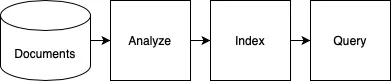

# search engine demo
这是一个简单的搜索引擎实现示例，包含Go和Python两个版本，主要用于演示倒排索引的基本原理和实现方式。项目包含基础的文档分析、关键词提取和搜索功能。
> python version code from :https://github.com/halvorboe/search-engine
## 快速开始
确保你安装了python 环境，并且在根目录下，运行下面命令，下载数据。
```azure
python download_data.py
```

### golang版本

确保你在`search_engine`文件夹下，并且已经安装go语言环境。

```azure
go run main.go
```

### python版本
确保你在`search_engine`文件夹下，并且已经安装python环境。
```azure
cd ./python_version
python main.py
```
> 如果你没有python环境，我推荐使用python环境管理工具，如conda等管理python环境，而非直接安装python环境。

## 核心功能特性
- 倒排索引构建：从文本数据中提取关键词并建立索引
- 文档检索：支持基于关键词的文档搜索
- 结果截取：限制返回结果数量（最多3条）
- 跨语言实现：提供Go和Python两个版本便于对比学习

### 关键名词解读
- **document**：文档，表示一个可被搜索的数据单元
- **tokens**：分词，将文档拆分成的词语序列，可以简单理解成terms组成的序列
- **terms**：规范化后的唯一词汇
- **index**：倒排索引，记录术语到文档的映射关系
- **query**：用户输入的查询条件




## 更多
更基础的讲解在我的wechat 公众号里面，欢迎来访。
